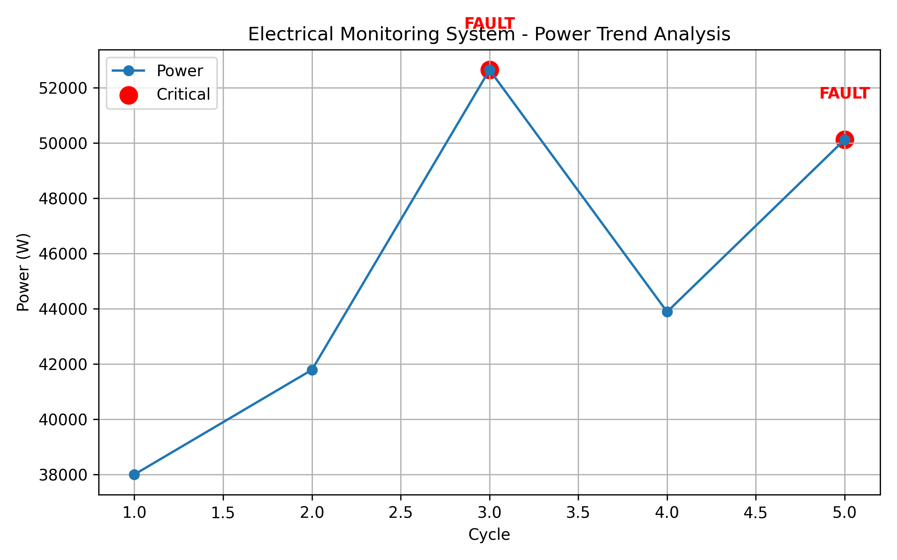

## Author

**Willy Brice Happi**  
Wind Turbine Technician | Electrical Engineering Student  

GitHub: (https://github.com/Wkemajou0415/mini-scada-monitoring-system/edit/main/README.md)
## Mini SCADA-Style Electrical Monitoring System
A Python-based monitoring system simulating electrical behavior, fault detection, and SCADA-style visualization.

## Overview

This project is a Python-based mini SCADA-style electrical monitoring system. It simulates current and voltage readings, calculates power, detects abnormal conditions, and visualizes system behavior.

The system identifies warning and critical states, logs events, and generates both a CSV report and a power trend graph with fault annotations.

## Features

- Simulates current and voltage data
- Calculates electrical power (P = V × I)
- Classifies system status: Normal, Warning, Critical
- Detects ALERT and FAULT events
- Tracks system states: STABLE, UNSTABLE, SHUTDOWN
- Exports monitoring data to CSV
- Generates a power trend graph
- Highlights critical points with FAULT labels

## Technologies Used

- Python
- Matplotlib
- CSV module

## Output Files

- `mini_scada_report.csv` → Monitoring data log  
- `scada_power_graph.png` → Power trend with fault visualization  

## Power Trend Visualization



## Real-World Relevance

This project reflects core concepts used in industrial monitoring systems, including:

- Electrical power analysis  
- Fault detection and alarm logic  
- Data logging and reporting  
- SCADA-style visualization  

It is directly applicable to wind turbine monitoring and electrical engineering diagnostics.

## How to Run

```bash
python scada_monitor.py

## Project Status

Completed – Demonstrates core concepts of monitoring systems and data visualization.
